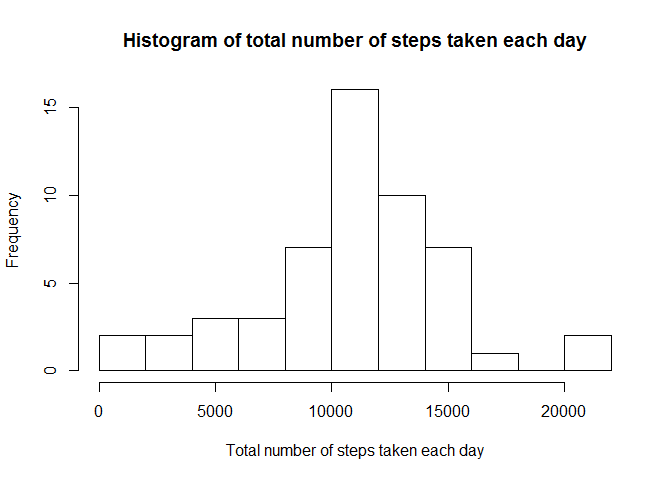
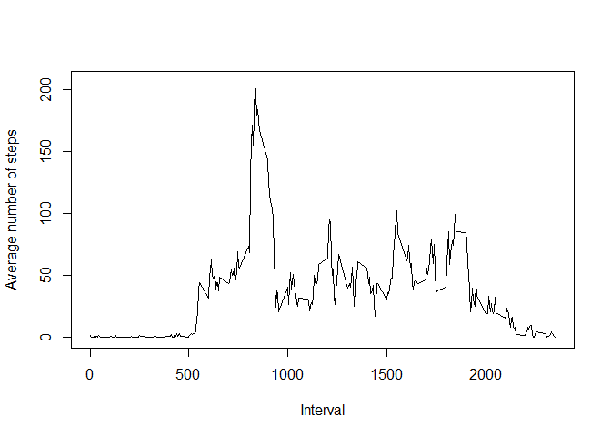
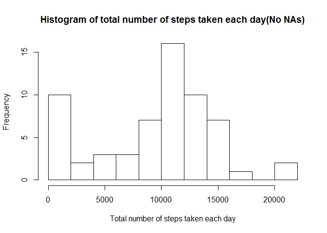
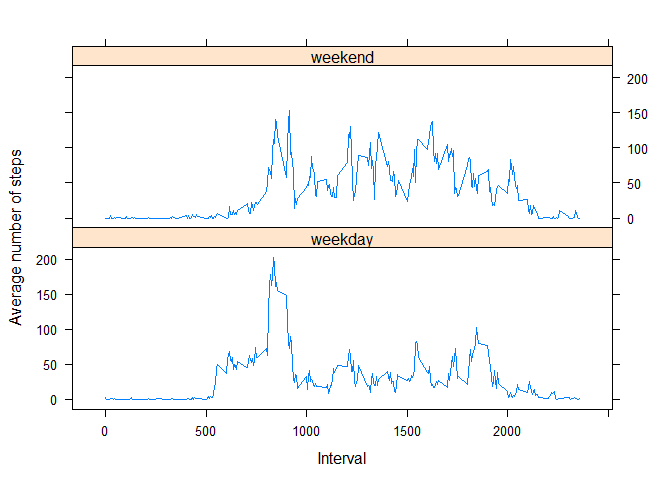

# Reproducible Research: Peer Assessment 1


## Loading and preprocessing the data

The dataset is stored in a comma-separated-value (CSV) file "activity.csv" and there are a total of 17,568 observations in this dataset. Here the data will be loaded and assign to "df0".


```r
if (!file.exists("activity.csv")) {
    unzip("repdata-data-activity.zip")
    }
df0 <- read.csv("activity.csv")
```

## What is mean total number of steps taken per day?

To calculate the mean total number of steps taken per day, I remove all the rows in which the values of steps are NAs. The new dataset without NAs is "df1". Then I calculate the sum of steps per day. The data is stored in "sdf". Having the sum of steps per day, the mean and median number of steps are calculated.


```r
df1 <- df0[complete.cases(df0[,1]),1:2]
sdf <- aggregate(df1$steps, by = list(df1$date), FUN = sum)
colnames(sdf) <- c("date", "sumSteps")
hist(sdf$sumSteps, breaks = 11, main = "Histogram of total number of steps taken each day", xlab = "Total number of steps taken each day")
```

 

```r
m1 <- mean(sdf$sumSteps)
cat("mean total number of steps taken per day = ", m1)
```

```
## mean total number of steps taken per day =  10766.19
```

```r
m2 <- median(sdf$sumSteps)
cat("median total number of steps taken per day = ", m2)
```

```
## median total number of steps taken per day =  10765
```
According to the calculation above, the mean total number of steps taken per day is 1.0766189\times 10^{4}. The median total number of steps taken per day is 10765.

## What is the average daily activity pattern?

To see the average daily activity pattern, the number of steps taken vs. 5-minute interval is averaged across all days and stored in "mdf". Then the maximum value and index of averaged number of steps are found and stored in "m3" and "ind".


```r
df2 <- df0[complete.cases(df0[,1]),c(1,3)]
mdf <- aggregate(df2$steps, by = list(df2$interval), FUN = mean)
colnames(mdf) <- c("interval", "meanSteps")
plot(mdf$interval, mdf$meanSteps, type = "l", xlab = "Interval", ylab = "Average number of steps")
```

 

```r
m3 <- max(mdf$meanSteps)
m3
```

```
## [1] 206.1698
```

```r
m4 <- which.max(mdf$meanSteps)
ind <- mdf[m4, 1]
ind
```

```
## [1] 835
```
The interval 835, on average across all the days in the dataset, contains the maximum number of steps. And the maxiumum average number of steps is 206.1698113.

## Imputing missing values

The total number of missing values in the dataset is the differnce between the number of observations in the raw dataset "df0" and the number of observations in the processed dataset "df2" which does not have NAs.

```r
missn <- dim(df0)[1] - dim(df2)[1]
```
The total number of missing values in the dataset is 2304.

Now, all the NAs in the data will be replaced. If all the steps in a particular day are all NAs, then all NAs in that day will be replaced by 0. Otherwise, the NAs in a day will be replaced by the mean number of steps in that day.

```r
df3 <- split(df0, df0$date)
for (i in 1:length(df3)) {
    if (all(is.na(df3[[i]][, 1])) == TRUE ) {
        l1 <- length(df3[[i]][, 1]) 
        df3[[i]][,1] = rep(0, l1)
    } else{
        vna <- df3[[i]][, 1]
        l2 <- sum(is.na(df3[[i]]$steps))
        if (l2 > 0) {
            df3[[i]][vna,1] = rep(mean(df3[[i]][, 1], na.rm = TRUE), l2)
        }
    }
}
df3nona <- unsplit(df3, df0$date)
sdf3 <- aggregate(df3nona$steps, by = list(df3nona$date), FUN = sum)
colnames(sdf3) <- c("date", "sumSteps")
hist(sdf3$sumSteps, breaks = 11, main = "Histogram of total number of steps taken each day(No NAs)", xlab = "Total number of steps taken each day")
```

 

```r
m31 <- mean(sdf3$sumSteps)
cat("the mean total number of steps taken per day = ", m31)
```

```
## the mean total number of steps taken per day =  9354.23
```

```r
m32 <- median(sdf3$sumSteps)
cat("the median total number of steps taken per day = ", m32)
```

```
## the median total number of steps taken per day =  10395
```

All these values(sum, mean, and median) differ from the estimates from the first part of the assignment. Compare the histogram obtained from part 1 of the assignment, one can see that the frequency of 0~2000 steps taken each day significantly increased. This is because all the steps in 8 days are NAs and the NAs were replaced by 0. So for those 8 days, the total bumber of steps each day is 0 whereas in part 1, the data of those 8 days were dropped and had no show in the histogram obtained in part 1.  

In this part, the mean total number of steps taken per day is 9354.2295082. The median total number of steps taken per day is 1.0395\times 10^{4}. Both are smaller than the results obtained in part 1. In part 1, the NAs were removed and were not counted to the total number of steps. In this part (part 3), the NAs were replaced by mean number of steps in that day. From this point of view, the mean and median total number of steps taken per day should increase compared to part 1. However, within 61 days there are 8 days with all values of steps unavailable. Those NAs were replaced by 0. This most significantly impact the mean and median value obtained in this part. As a result, the mean and median values were lowered. 


## Are there differences in activity patterns between weekdays and weekends?

Use the dataset with the filled-in missing values "df3nona". Create a new factor variable "weekend" in the dataset "df3nona" with two levels - "weekday" and "weekend" indicating whether a given date is a weekday or weekend day. The average number of steps taken on 5-min intervals are calculated across all weekday days or weekend days. The results are stored in "df4c".


```r
df3nona$day <- weekdays(as.Date(df3nona$date))
l3 <- dim(df3nona)[1]
df3nona$weekend <- rep("N", l3)
df3nona$weekend[df3nona$day %in% c('Saturday','Sunday')] <- "Y"
df3nona$weekend <- factor(df3nona$weekend, c("Y", "N"), labels = c("weekends", "weekdays"))
df4 <- split(df3nona, df3nona$weekend)
mdf41 <- aggregate(df4[[1]]$steps, by = list(df4[[1]]$interval), FUN = mean)
colnames(mdf41) <- c("interval", "meanSteps")
mdf42 <- aggregate(df4[[2]]$steps, by = list(df4[[2]]$interval), FUN = mean)
colnames(mdf42) <- c("interval", "meanSteps")
mdf41$weekend <- rep("weekend", dim(mdf41)[1])
mdf42$weekend <- rep("weekday", dim(mdf42)[1])
df4c <- rbind(mdf41, mdf42)
df4c$weekend <- as.factor(df4c$weekend)
library(lattice)
xyplot(meanSteps ~ interval | weekend, df4c, type = "l", layout = c(1, 2), xlab = "Interval", ylab = "Average number of steps")
```

 

The panel plots show the difference in activity pattern between weekends and weekdays. Generally, there are more steps on weekends than on weekdays. A high peak of average steps appear around interval 800, which has value about 200. There are several other peaks of average steps between interval 500 and 2000, but they are much smaller. They are between 50 to 100. As comparison, the peaks of average steps on weekends appear between interval 800 and 2000. A lot of them have values between 50 to 150.
